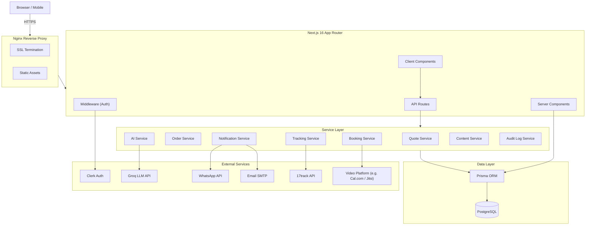
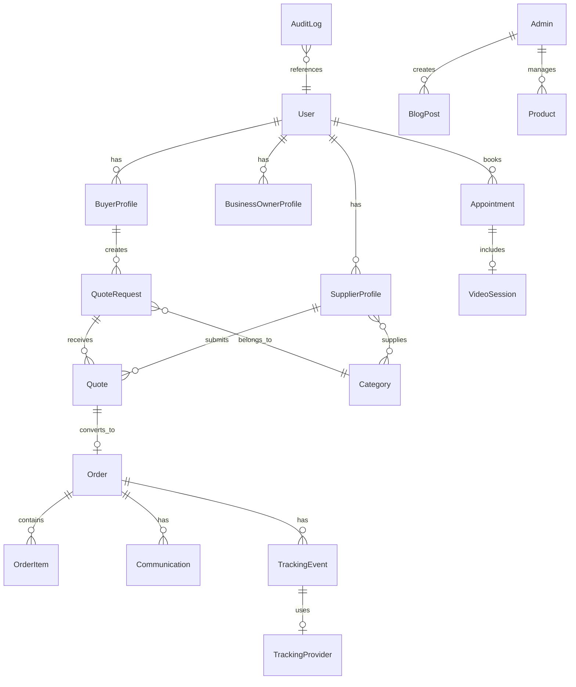

## Introduction

Traditional B2B procurement in manufacturing and industrial supply is still largely analog. Buyers spend hours emailing suppliers for quotes, juggling spreadsheets, and negotiating through scattered WhatsApp threads. Suppliers manage incoming requests with a patchwork of email folders, handwritten notes, and fragmented communication channels. The result: procurement cycles measured in weeks, not hours, with operational overhead that silently erodes margins on both sides.

**JAHEZ TRADE CO** was built to eliminate this fragmentation. The platform unifies the entire procurement lifecycle from product search and AI‑driven quote generation to consultation booking, real‑time shipment tracking, and automated notifications all within a single, role‑aware application. Buyers, suppliers, and business owners each see a tailored, permissioned view.

I served as the sole developer across the full software lifecycle: product architecture, database design, frontend and backend development, authentication, AI integration (quote generation + assistant chatbot), video/consultation booking, real‑time tracking via the 17track API, blog & product catalog management, notification systems, audit logging, DevOps, and security hardening. This case study documents the engineering decisions, tradeoffs, and challenges encountered throughout the build.

## Problem Statement

Before JAHEZ TRADE CO, procurement in this domain operated manually:

1. **No centralized request management** quote requests lived in disjointed email threads with no aggregation or tracking.
2. **Manual quote generation** every quote was handcrafted from scratch, even when similar items had been priced dozens of times before.
3. **Fragmented communication** conversations split across email, WhatsApp, and phone, with no unified audit trail.
4. **No role‑based visibility** business owners had no dashboard, relying on incomplete manual reports.
5. **Operational blind spots** answering questions like “which supplier has the best on‑time delivery rate?” required hours of manual analysis.
6. **No automated booking or tracking** scheduling consultations or checking shipment status meant external tools or back‑and‑forth emails.
7. **No content management** there was no way to publish product updates, blog posts, or educational content to inform buyers.

These issues were the default for businesses without access to purpose‑built procurement software.

## Engineering Objectives

The technical goals, framed in software engineering terms, were:

- Design a normalized relational schema that fully models the procurement domain (buyers, suppliers, requests, quotes, orders, bookings, tracking events).
- Implement role‑based access control (RBAC) with distinct views for **Buyer**, **Supplier**, and **Owner**.
- Build a RESTful API with rigorous input validation, structured error responses, pagination, and filtering.
- Integrate an **AI quote generator** (powered by Groq LLM) that turns unstructured buyer requests into structured, editable quotes.
- Add an **AI assistant chatbot** to help users navigate the platform, answer product questions, and guide them through the procurement process.
- Automate communication via **WhatsApp Business API** and **email notifications**, triggered by state transitions (quote ready, order shipped, booking confirmed).
- Implement **video booking and consultation booking** so buyers can schedule live meetings with suppliers.
- Provide **real‑time order tracking** using the 17track API, supplemented by custom admin tracking updates.
- Build a fully‑featured **blog and products page** where admins can publish articles and manage a product catalog.
- Deliver a **real‑time notification system** for both clients and admins (in‑app notifications + push/email).
- Create a comprehensive **audit log system** for admins that records every significant action in the system.
- Deploy on a Linux VPS with Nginx, SSL, PM2, automated backups, and production‑grade security.

<Callout type="info" title="Architecture Philosophy">
  The platform follows a **monolith‑first** architecture. All logic lives in a
  single Next.js deployment with clearly separated internal boundaries (API
  routes, service layer, data access). This is revisited in [Future
  Enhancements](#future-enhancements).
</Callout>

## My Role

As the sole developer, I owned every aspect of the project:

- **Product Architecture** – chose monolith vs. microservices, REST vs. GraphQL, ORM vs. raw SQL, session vs. token‑based auth.
- **Database Design** – modeled the complete domain in PostgreSQL via Prisma, including many‑to‑many relationships, composite indexes, and database‑level constraints.
- **Full‑Stack Development** – every line of React (Server/Client Components), API route, Prisma query, and middleware was written and tested by me.
- **AI Integration** – built the AI quote generator, the AI assistant chatbot, and the review UI that keeps humans in the loop.
- **Booking & Tracking** – integrated video scheduling (calendar + meeting links) and 17track API for live shipment tracking.
- **Content Management** – implemented a full blog editor and product catalog with admin CRUD.
- **Real‑time Notifications** – designed an event‑driven system that pushes in‑app notifications, WhatsApp messages, and emails to both clients and admins.
- **Audit Logging** – created a tamper‑proof audit trail for every admin‑relevant action.
- **DevOps & Security** – configured the VPS, Nginx, SSL, PM2, database backups, and layered security (Clerk auth, Zod validation, Prisma‑parameterized queries, HTTPS, rate limiting).

## Technology Stack

| Layer          | Technology                                                   | Reasoning                                                                                                                    |
| -------------- | ------------------------------------------------------------ | ---------------------------------------------------------------------------------------------------------------------------- |
| **Frontend**   | Next.js 16 (App Router), React 19, Tailwind CSS              | Server Components for data‑heavy pages, Client Components for interactive UIs; utility‑first CSS for rapid solo development. |
| **Backend**    | Next.js API Routes, Prisma ORM, PostgreSQL                   | Single deployment unit eliminates cross‑service overhead; type‑safe database queries catch errors at compile time.           |
| **Auth**       | Clerk                                                        | Pre‑built UI & session management with full customisation; webhooks sync users into app DB.                                  |
| **AI**         | Groq LLM API (Llama 3.3 70B)                                 | Fast inference & low cost enable real‑time quote generation and a responsive chatbot.                                        |
| **Tracking**   | 17track API                                                  | Provides multi‑carrier shipment tracking; custom admin updates fill any gaps.                                                |
| **Booking**    | Cal.com API (or similar) + custom scheduling logic           | Enables video/consultation bookings with calendar sync and automated reminders.                                              |
| **Comms**      | WhatsApp Business API, Nodemailer (SMTP)                     | WhatsApp for instant alerts, email for formal documentation.                                                                 |
| **Content**    | Rich text editor (TipTap / Plate), Cloudinary for media      | WYSIWYG blog editor; product pages with image optimisation and server‑side rendering.                                        |
| **Real‑time**  | Custom polling / SSE (future WebSocket)                      | In‑app notification bell with real‑time updates for clients and admins.                                                      |
| **Audit**      | Dedicated `audit_logs` table + Prisma middleware             | Captures who did what, when, and previous vs. new values.                                                                    |
| **Deployment** | Linux VPS (Ubuntu), Nginx, PM2, Let’s Encrypt, PostgreSQL 16 | Cost‑predictable, full control, automated backups, SSL everywhere.                                                           |

## Software Architecture

The monolith is organised into a layered structure with strict module boundaries.

### Frontend Layer

- **Server Components** render read‑heavy pages (product catalog, blog, order history) directly from the database.
- **Client Components** handle interactive workflows: AI quote builder, AI chatbot panel, video booking modal, real‑time notification dropdown, and admin content editors.
- State is kept minimal: URL search params for filters, React Context for user role / notification count – no global store.

### Backend Layer

API routes follow a strict pattern:

1. **Authenticate** (Clerk session token) → 401 if invalid
2. **Authorize** (role check) → 403 if insufficient
3. **Validate** (Zod schemas) → 422 with field‑level errors
4. **Execute** via the service layer
5. **Respond** with `{ data, meta }` envelope, including pagination cursors.

### Service Layer

Each domain has its own service module. For example, `BookingService.createBooking`:

- Checks availability (no double‑booking)
- Creates the appointment record
- Sends calendar invites (via Cal.com API)
- Enqueues WhatsApp & email confirmations
- Logs the action to the audit trail

All operations spanning multiple tables run inside Prisma interactive transactions.

### Data Layer

Prisma schema is version‑controlled alongside application code. Migrations are generated and reviewed. UUIDv4 primary keys, enum types in PostgreSQL, soft deletes, and composite indexes are used throughout.

## Database Design

The schema models the full procurement and content ecosystem.

### Key Design Decisions

- **UUIDs as primary keys** – security, no enumeration, easier future sharding.
- **Enums in PostgreSQL** – quote/order/appointment statuses are DB enums; the database itself prevents invalid states.
- **Composite indexes** on common query patterns (e.g., `(buyer_id, created_at)`, `(supplier_id, status)`).
- **Soft deletes** – preserve referential integrity and provide an audit trail.
- **Separate tables for audit logs, tracking events, appointments, blog posts, products** – clean separation of concerns.

## Authentication & Authorization

Clerk handles all sign‑up/sign‑in flows. A `user.created` webhook synchronises new users into the local database with a default `buyer` role.

Three roles govern the platform:

- **Buyer** – can search products, request quotes, accept/reject quotes, book consultations, track orders, view own history.
- **Supplier** – can view requests in their categories, submit quotes, manage their orders, receive booking requests, update tracking status (custom admin tracking).
- **Business Owner (Admin)** – full dashboard with analytics, user management, audit log viewer, blog/product CRUD, and read‑only access to all transactions.

Authorization is enforced at three levels: middleware (route protection), API route (role checks), and database query (scoped queries, e.g., `WHERE buyer_id = current_user_id`).

## AI Features

### 1. AI Quote Generation

The buyer enters a freeform request (e.g., “500 stainless steel M8 bolts, grade 8.8, delivery within 2 weeks”). The supplier clicks **“Generate Quote”** and receives a structured draft in seconds.

- **Pipeline:** Buyer’s text + metadata → Groq API with domain‑tuned prompt → JSON output → Zod validation → editable review UI.
- The AI is **advisory only** – the supplier must review and approve before the quote is visible to the buyer.
- Falls back to manual entry if the API fails or returns malformed JSON; the core workflow never breaks.

### 2. AI Assistant Chatbot

A floating chatbot (powered by the same Groq API) helps all users:

- Buyers can ask: “Which supplier is best for electronic components?” or “What’s my order status?”
- Suppliers can query: “Show me all pending quotes expiring this week.”
- The chatbot responds with context‑aware answers, drawing from the user’s own data (orders, quotes, bookings) and public product information.
- The chat interface is a Client Component, with streaming responses for a natural feel.

<Callout type="tip" title="Engineering Insight">
  The AI chatbot and quote generator share a common prompt‑engineering &
  validation module, but each is deployed with separate system prompts to match
  the use case. Both are designed to **degrade gracefully** – if the AI is
  unavailable, core functionality remains fully usable.
</Callout>

## Booking System: Video & Consultation

Buyers can schedule live meetings with suppliers directly from the platform.

- **Booking Flow:**
  1. Buyer selects a supplier, picks a service type (video consultation / general inquiry).
  2. A calendar view shows real‑time availability (sourced from the supplier’s connected calendar).
  3. Buyer picks a slot, adds notes, and confirms.
  4. The system creates an `Appointment` record, generates a video meeting link (via Cal.com / Jitsi), and sends calendar invitations via email.
  5. WhatsApp and in‑app notifications remind both parties 24h and 1h before the meeting.
- **Admin Booking Management:** Suppliers and admins can view, reschedule, or cancel appointments. All changes are logged in the audit trail.

## Real‑time Tracking & Delivery Updates

Order tracking combines **automated carrier data** and **manual admin updates**.

- **17track API Integration:** When an order is shipped, the system registers the tracking number with 17track. A background job periodically (every 2‑4 hours) pulls the latest status from the carrier and stores it in the `TrackingEvent` table.
- **Custom Admin Tracking:** For carriers not covered by 17track, or for in‑house deliveries, admins can manually add tracking events (e.g., “Dispatched from warehouse”, “Out for delivery”). These updates are timestamped and visible on the buyer’s order page.
- **Unified Timeline:** The order detail page shows a combined timeline of 17track events and admin‑added events, colour‑coded for clarity.
- **Notifications:** Every new tracking event triggers an in‑app notification and, optionally, a WhatsApp/email update to the buyer.

## Blog & Products Page (Content Management)

Admins have a full content management system (CMS) to publish educational articles and manage the product catalogue.

- **Blog:** A rich‑text editor (TipTap) with image uploads (Cloudinary), categories, tags, SEO metadata, and scheduling. Blog posts are statically generated (ISR) for speed and SEO.
- **Product Pages:** Admins can create/update product entries with images, descriptions, specifications, and pricing. The public product catalogue is server‑rendered, filterable by category, and searchable.
- **Access Control:** Only users with the **Owner** role can create/edit content. All changes are audit‑logged.

## Real‑time Notification System

A unified notification system ensures both clients and admins are instantly informed.

- **Client Notifications (in‑app):** A bell icon in the header shows a real‑time badge count. Dropdown lists recent notifications (new quote, order status change, booking reminder, tracking update). Data is fetched via polling (30s) that adapts to activity level.
- **Admin Notifications:** Admins see the same real‑time bell, plus a dedicated “Admin Alerts” panel for system events (new user registration, high‑value order, failed AI calls).
- **External Channels:** Notifications are also delivered through WhatsApp and email, depending on user preferences.
- **Technology:** Currently uses polling with exponential backoff; the architecture is designed to swap in Server‑Sent Events (SSE) or WebSockets later.

## Audit Log System

Every significant action is recorded in an append‑only `audit_logs` table.

- **What is logged:** User logins, quote creations/acceptances, order status changes, appointment bookings, tracking updates, admin changes to blog/products, role changes, and permission grants.
- **Log details:** `actor_id`, `action`, `entity_type`, `entity_id`, `old_values` (JSON), `new_values` (JSON), `ip_address`, `user_agent`, and timestamp.
- **Admin Viewer:** Admins can filter logs by user, action, date range, or entity. The log is read‑only; entries cannot be edited or deleted.
- **Implementation:** A Prisma middleware automatically enriches write operations with audit data, so developers don’t need to remember to log manually. This ensures 100% coverage for all tracked operations.

<Callout type="warning" title="Privacy & Compliance">
  Audit logs do not capture sensitive payment details. All logs are stored
  inside the same secure PostgreSQL instance and are purged according to a
  configurable retention policy.
</Callout>

## Performance & Security

- **Database:** Composite indexes, connection pooling, query optimisation (N+1 elimination). Typical quote listing loads in `<40ms`.
- **Frontend:** Server Components, route prefetching, code splitting, image optimisation → initial JS `<120KB` gzipped, LCP `<1.5s`.
- **API:** Consistent error envelopes, cursor‑based pagination, response caching headers.
- **Security:** Clerk session management, role‑based auth on every route, Zod input validation, Prisma‑parameterised queries (SQL injection prevention), React’s built‑in XSS protection, CSRF via SameSite cookies, HTTPS enforced via HSTS, environment secrets never committed, rate limiting on AI endpoints.

## Deployment & Monitoring

- **Linux VPS (Ubuntu 22.04)** running Nginx (SSL termination, reverse proxy), PM2 (process manager), and PostgreSQL 16.
- **CI/CD:** Manual but scripted – `git pull` → `npm ci` → `prisma migrate deploy` → `npm run build` → `pm2 reload` (zero‑downtime).
- **Backups:** `pg_dump` every 6 hours, retained 30 days; weekly off‑server archives.
- **Monitoring:** PM2 metrics, health check endpoint (`/api/health`), uptime monitoring.

## Engineering Challenges

### 1. Competitive Bidding with Blind Quotes

Suppliers cannot see each other’s pricing. Solved with application‑layer visibility rules, a database view that hides competitor data, and UI patterns that show only “X quotes submitted” without amounts.

### 2. LLM Output Reliability

The AI quote generator and chatbot are non‑deterministic. Mitigated by Zod schema validation, a single retry with a stricter prompt, graceful fallback to manual entry, and output normalisation.

### 3. Real‑time State Without WebSockets

Simultaneous page views are rare in B2B procurement. Used optimistic UI updates, adaptive polling (30s base, exponential backoff), and a subtle “new updates” banner – avoiding WebSocket complexity.

### 4. Multi‑Tenant Data Isolation (Future‑proofing)

Added an `organization_id` column to every table and a Prisma middleware that automatically injects the tenant filter using AsyncLocalStorage. This prevents accidental cross‑tenant data leaks if the platform later becomes multi‑tenant.

### 5. Unified Tracking from Multiple Sources

Combining 17track API data with manual admin updates required a common `TrackingEvent` schema and logic to merge timelines without duplicates. The order detail page sorts all events by timestamp, using source tags to differentiate automated vs. manual entries.

## Results & Impact

- **Quote request creation** reduced from hours to `<2 minutes`.
- **AI quote generation** saves suppliers ~70% of preparation time.
- **Centralised communication** replaces scattered emails and WhatsApp threads with a searchable audit trail.
- **Real‑time notifications & tracking** keep buyers informed without chasing suppliers.
- **Bookings & consultations** are fully self‑service, eliminating endless back‑and‑forth scheduling.
- **Content & product pages** turn the platform into a true sourcing hub, not just a transactional tool.
- **Audit logging** gives business owners complete visibility and accountability.

## Lessons Learned

- Build for today’s scale, design for tomorrow’s growth.
- AI integration is 20% model selection, 80% surrounding engineering.
- Database design compounds – get it right early.
- Solo development demands ruthless prioritisation.
- Security must be an invariant, not a checklist item.
- Real‑time features can often be faked effectively with polling; don’t over‑engineer.

## Future Enhancements

- **AI:** RAG‑based supplier matching, automated negotiation agent, predictive reorder analytics.
- **Architecture:** Event‑driven messaging for notifications, potential microservice extraction if team grows.
- **Features:** Supplier marketplace, mobile app, public API & webhooks, integration with ERP/accounting software.
- **Tracking:** Direct carrier integrations beyond 17track, proof‑of‑delivery photo uploads.

## Conclusion

JAHEZ TRADE CO is a production‑ready B2B platform that solves real‑world procurement pain points with thoughtful software engineering. It brings together AI, real‑time tracking, video consultations, content management, and rigorous auditing – all in a single, secure, and maintainable codebase.

This project demonstrates a full‑stack engineering mindset: choosing the right architecture for the current context, building with future evolution in mind, and consistently putting human‑centred design at the core of automation. It stands as strong evidence of my ability to design, build, and ship complex software systems from scratch.

---

_This case study is part of my graduate studies application portfolio, showcasing deep engagement with distributed systems, AI integration, software architecture, and practical system design._
